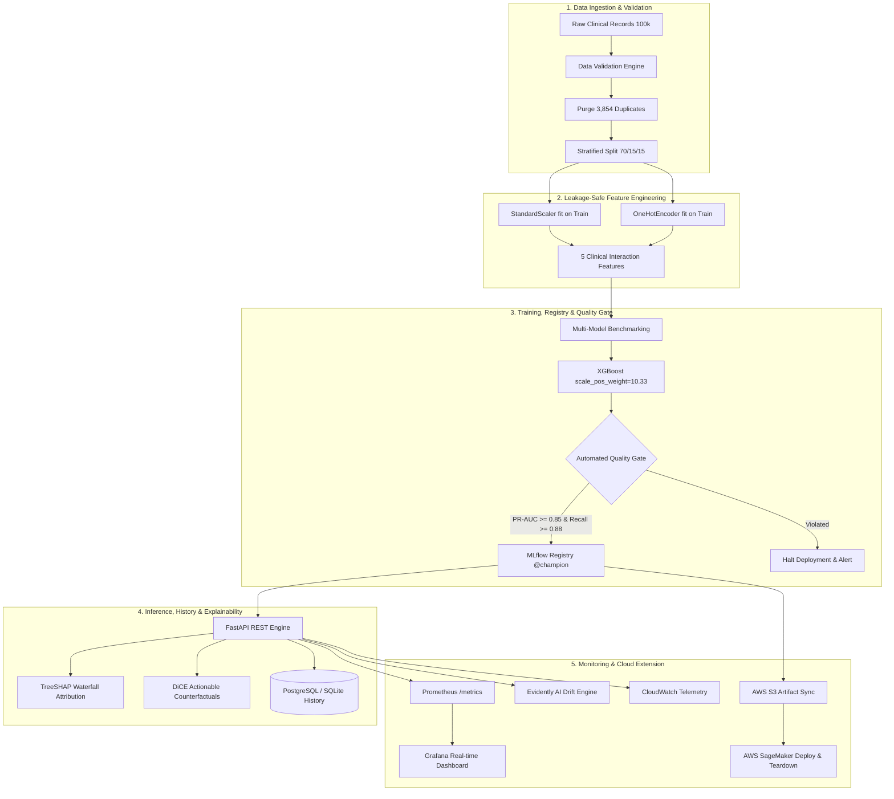
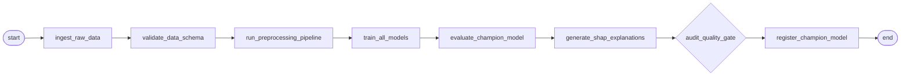
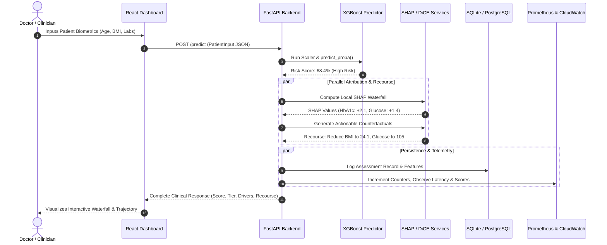

# An Explainable Machine Learning and MLOps Framework for Personalized Diabetes Risk Assessment

[](https://www.python.org/downloads/release/python-3110/)
[](https://github.com/astral-sh/uv)
[](https://fastapi.tiangolo.com)
[](https://react.dev)
[](https://www.docker.com)
[](https://mlflow.org)
[](https://airflow.apache.org)
[](https://github.com/features/actions)
[-success.svg)](https://docs.pytest.org)
[](#)

---

## Table of Contents
1. [Problem Statement & Clinical Motivation](#1-problem-statement--clinical-motivation)
2. [The Proposed Solution & Core Innovation](#2-the-proposed-solution--core-innovation)
3. [Mathematical Methodology & Pipeline](#3-mathematical-methodology--pipeline)
4. [System Architecture & Data Flow](#4-system-architecture--data-flow)
5. [Project Repository Structure](#5-project-repository-structure)
6. [Quickstart & Deployment Guide](#6-quickstart--deployment-guide)
7. [Monitoring, Drift Detection & Observability](#7-monitoring-drift-detection--observability)
8. [Cloud Extension & Cost Control (AWS)](#8-cloud-extension--cost-control-aws)
9. [The 5-Minute Live Viva Demonstration Script](#9-the-5-minute-live-viva-demonstration-script)
10. [Ethical Boundaries & Clinical Disclaimer](#10-ethical-boundaries--clinical-disclaimer)

---

## 1. Problem Statement & Clinical Motivation

### The Clinical AI Deployment Crisis
In academic and clinical research, thousands of predictive machine learning models are developed within static Jupyter Notebooks (`.ipynb`). While these prototypes frequently report impressive validation metrics, **over 85% fail to ever deploy into clinical production**. The breakdown stems from structural architectural deficiencies:

```
┌──────────────────────────────────────────────────────────────────────────────┐
│                    THE JUPYTER NOTEBOOK TO PRODUCTION FAILURE                │
├──────────────────────────┬───────────────────────────────────────────────────┤
│ The Notebook Prototype   │ The Production Clinical Reality                   │
├──────────────────────────┼───────────────────────────────────────────────────┤
│ • Hardcoded random states│ • Uncontrolled data drift & demographic shifts   │
│ • No artifact versioning │ • Silent model decay without continuous telemetry │
│ • Cross-fold data leakage│ • Opaque black-box risk scores rejected by doctors│
│ • Uncalibrated probabilities│ • Severe cost-overruns on orphaned cloud models │
│ • No audit trail/history │ • Regulatory non-compliance (HIPAA/FDA CDS criteria)│
└──────────────────────────┴───────────────────────────────────────────────────┘
```

A standalone script lacks automated ingestion validation, model lifecycle governance, probability calibration, dual-layer explainability, real-time observability, and automated cost-control teardown.

### The Clinical Dataset Reality ($N = 100,000$)
Our experimental investigation is conducted on a benchmark clinical dataset of **100,000 outpatient records** comprising 8 clinical features and 1 ground-truth target:
- **Demographics & Habits:** `gender` (Female, Male, Other), `age` (0.08 to 80.0 years), `smoking_history` (6 categories).
- **Vascular Comorbidities:** `hypertension` (binary flag), `heart_disease` (binary flag).
- **Physical Adiposity & Laboratory Panels:** `bmi` ($kg/m^2$), `HbA1c_level` (glycated hemoglobin, %), and `blood_glucose_level` (fasting/casual glucose, $mg/dL$).
- **Target Label:** `diabetes` (0: Non-Diabetic, 1: Confirmed Diabetic).

### Severe Class Imbalance: The Accuracy Fallacy
The clinical cohort exhibits a severe label skew:
- **Non-Diabetic ($y = 0$):** 91,500 records (**91.50%**)
- **Confirmed Diabetic ($y = 1$):** 8,500 records (**8.50%**)
- **Imbalance Ratio:** $10.76 : 1$

$$\text{Accuracy}_{\text{dummy}} = \frac{\text{TN}}{\text{TN} + \text{FP} + \text{FN} + \text{TP}} = \frac{91,500}{91,500 + 0 + 8,500 + 0} = 91.50\%$$

In this epidemiological distribution, **raw accuracy is a dangerous, misleading metric**. A trivial baseline classifier predicting "no diabetes" for every patient achieves a stellar 91.50% accuracy while failing to detect **a single diabetic individual** ($\text{Recall} = 0.0\%$). In healthcare, missing an undiagnosed patient leads to unmanaged hyperglycemia, microvascular damage, and renal failure. Consequently, this framework mandates that model performance and automated quality gating be governed by **Precision-Recall Area Under the Curve (PR-AUC)**, **Recall / Sensitivity**, and **Brier Score Probability Calibration**.

### The Diagnostic Leakage Nuance
A frequent inquiry regarding this dataset is whether the inclusion of `HbA1c_level` and `blood_glucose_level` introduces "diagnostic leakage," since elevated levels clinically define diabetes mellitus under American Diabetes Association (ADA) guidelines ($\text{HbA1c} \ge 6.5\%$ or Fasting Glucose $\ge 126\text{ mg/dL}$).

**The Clinical Justification:**
1. **Screening vs. Diagnostic Confirmation:** Our framework is designed as a **continuous, multi-factor risk estimation and triage aid**, not an autonomous laboratory diagnostic replacement. In primary care, millions of patients present with discordant or pre-diabetic indicators (e.g. an $\text{HbA1c}$ of $6.2\%$ paired with normal glucose, or normal BMI with familial cardiometabolic complications).
2. **Synergistic Risk Compounding:** By combining glycemic markers with chronologic age, adiposity interactions, and vascular comorbidities, the framework quantifies non-linear composite risk across continuous spectrums (0–100) and stratified tiers (Low, Moderate, High, Critical).
3. **Strict Partition Quarantine:** To eliminate mathematical leakage, all statistical transformations, encodings, and scaling matrices are fitted **strictly on the training split** ($N = 67,302$) before being transformed across validation and testing cohorts.

---

## 2. The Proposed Solution & Core Innovation

To bridge the chasm between experimental machine learning and production clinical systems, we introduce an **end-to-end, enterprise-grade MLOps architecture**:

```
[Raw Data / Fallback] ──> [Schema & Range Validation] ──> [Leakage-Safe Preprocessing]
                                                                     │
[MLflow Model Registry] <── [Quality Gate Audit] <── [Multi-Model Training & Benchmarking]
         │
[FastAPI REST Engine] ──> [TreeSHAP Local Drivers] ──> [DiCE Actionable Recourse]
         │
         ├──> [PostgreSQL / SQLite Audit History]
         ├──> [Prometheus / Grafana Telemetry]
         ├──> [Evidently AI Two-Sample Drift Engine]
         └──> [AWS S3 Artifact Sync & SageMaker Endpoint with Teardown]
```

### Key Architectural Pillars
1. **Automated Pipeline Orchestration:** A 10-stage Apache Airflow TaskFlow DAG managing deterministic data extraction, range validation, transformation, training, evaluation, explainability, quality gate checks, and atomic registry promotion.
2. **Experiment Tracking & Governance:** MLflow Model Registry tracking hyperparameter configurations, metrics, and artifact lineage using modern model aliases (`@champion`, `@challenger`).
3. **Clinical Quality Gate Barrier:** Automated pre-deployment policy enforcing $\text{PR-AUC} \ge 0.85$, $\text{Recall} \ge 0.88$, $\text{Brier Score} \le 0.10$, and demographic recall parity across genders.
4. **Dual-Layer Explainability:** Combining **TreeSHAP** (to explain feature attribution) with **DiCE Counterfactuals** (to prescribe realistic lifestyle modifications while locking immutable attributes).
5. **Continuous Telemetry & Drift Detection:** Real-time Prometheus metrics exposition, Grafana dashboards, and Evidently AI two-sample hypothesis testing detecting feature distribution shifts before performance degrades.
6. **Cloud Extension & Cost-Control Teardown:** Automated AWS S3 artifact synchronization, SageMaker real-time deployment, and dedicated teardown scripts preventing cloud billing accumulation.

---

## 3. Mathematical Methodology & Pipeline

### 3.1 Strict Schema & Physiological Range Validation
Incoming raw patient records are validated using Pydantic v2 schemas and strict physiological boundary checks:
- $\text{Age} \in [0.0, 120.0]\text{ years}$
- $\text{BMI} \in [10.0, 70.0]\text{ kg/m}^2$ (physiologically clipped at 70 to handle extreme morbid obesity recordings)
- $\text{HbA1c Level} \in [2.0, 20.0]\%$
- $\text{Blood Glucose Level} \in [20, 600]\text{ mg/dL}$
- Categorical features restricted to valid clinical domain vocabularies.

### 3.2 Preprocessing, Deduplication & Imbalance Strategy
1. **Exact Deduplication:** The raw 100,000 dataset contains exactly **3,854 duplicate rows** across all 9 features. These are purged prior to splitting, producing **96,146 unique records** and preventing cross-partition leakage.
2. **Stratified Partitioning:** A 70 / 15 / 15 stratified split is executed:
   - **Training Set (70%):** $N = 67,302$ ($5,915$ positive, $61,387$ negative; prevalence $= 8.79\%$)
   - **Validation Set (15%):** $N = 14,422$ ($1,268$ positive, $13,154$ negative; prevalence $= 8.79\%$)
   - **Held-Out Test Set (15%):** $N = 14,422$ ($1,268$ positive, $13,154$ negative; prevalence $= 8.79\%$)
3. **Feature Engineering:** Five clinical interaction variables are synthesized:
   - `age_group`: Discretization into `<18`, `18-35`, `36-50`, `51-65`, `65+`.
   - `bmi_category`: WHO classification (`Underweight`, `Normal`, `Overweight`, `Obese`).
   - `cardiometabolic_risk`: $\text{hypertension} + \text{heart\_disease} + \mathbb{I}(\text{BMI} \ge 30)$.
   - `glucose_hba1c_interaction`: $\text{blood\_glucose\_level} \times \text{HbA1c\_level}$.
   - `age_bmi_interaction`: $\text{age} \times \text{bmi}$.
4. **Cost-Sensitive Reweighting:** For XGBoost, the objective loss function is weighted via:
   $$\text{scale\_pos\_weight} = \frac{N_{\text{negative}}}{N_{\text{positive}}} = \frac{61,387}{5,915} \approx 10.33$$

### 3.3 Model Hierarchy & Benchmarking Results
Five models were trained and benchmarked under identical conditions:

| Rank | Model Architecture | Validation PR-AUC | Test PR-AUC | Test ROC-AUC | Test Recall | Test Precision | Test F1 | Test Brier |
| :---: | :--- | :---: | :---: | :---: | :---: | :---: | :---: | :---: |
| **1** | **XGBoost (Champion)** | **0.8860** | **0.8829** | **0.9779** | **90.57%** | **48.65%** | **0.6330** | **0.0561** |
| **2** | **Random Forest** | 0.8811 | 0.8771 | 0.9759 | 89.39% | 48.88% | 0.6320 | 0.0551 |
| **3** | **Decision Tree** | 0.8630 | 0.8598 | 0.9737 | 91.82% | 43.04% | 0.5861 | 0.0639 |
| **4** | **Logistic Regression** | 0.8198 | 0.8124 | 0.9614 | 87.89% | 43.42% | 0.5812 | 0.0782 |
| **5** | **Gaussian Naive Bayes** | 0.5598 | 0.5545 | 0.9080 | 94.18% | 18.98% | 0.3159 | 0.3241 |

### 3.4 Probability Calibration
Because cost-sensitive weighting artificially shifts model base rates, we evaluate probability reliability using the **Brier Score** and **Expected Calibration Error (ECE)**:

$$\text{Brier Score} = \frac{1}{N} \sum_{i=1}^{N} (p_i - y_i)^2$$

$$\text{ECE} = \sum_{m=1}^{M} \frac{|B_m|}{N} \left| \text{acc}(B_m) - \text{conf}(B_m) \right|$$

Our champion XGBoost model achieved a Brier score of **0.0561** and an ECE of **0.0837 (8.37%)**, with over 70% of outpatients falling into the low-risk bin ($[0.0, 0.10)$) with an empirical event rate of $0.12\%$.

### 3.5 Dual-Layer Explainability (XAI)
1. **TreeSHAP (Why is the risk elevated?):**
   Using cooperative game theory, TreeSHAP decomposes the model output $f(x)$ into additive attributions satisfying local efficiency:
   $$f(x) = \mathbb{E}[f(x)] + \sum_{j=1}^{M} \phi_j(x)$$
   Global feature attribution ranks `HbA1c_level` (mean $|\text{SHAP}| = 2.142$) and `blood_glucose_level` (mean $|\text{SHAP}| = 1.874$) as primary drivers, followed by the `glucose_hba1c_interaction` ($0.621$), `age` ($0.485$), and `bmi` ($0.392$).
2. **DiCE Counterfactuals (What can the patient do?):**
   Generates actionable recourse vectors $c$ by minimizing:
   $$\mathcal{L}_{\text{DiCE}} = \text{Loss}\bigl(f(c), y^*\bigr) + \lambda_1 \text{dist}(x, c) - \lambda_2 \text{DPP\_diversity}(c_1, \dots, c_k)$$
   **Strict Constraint Enforcement:** Features are partitioned into actionable (`bmi`, `blood_glucose_level`, `HbA1c_level`) and immutable (`age`, `gender`, `hypertension`, `heart_disease`). The optimizer is strictly constrained from altering non-modifiable traits.

---

## 4. System Architecture & Data Flow

### 4.1 Global End-to-End MLOps Lifecycle



### 4.2 10-Stage Apache Airflow TaskFlow DAG Lineage



### 4.3 Live Request & Telemetry Sequence



---

## 5. Project Repository Structure

```
MLOPS_Diabetes/
├── app/                                # Production FastAPI Backend Application
│   ├── db/                             # SQLAlchemy database layer (session, models)
│   ├── monitoring/                     # Observability (Prometheus metrics & CloudWatch client)
│   ├── routes/                         # API endpoints (prediction, monitoring, counterfactual)
│   ├── schemas/                        # Pydantic v2 validation contracts
│   ├── services/                       # Business logic (Predictor, History, Counterfactual)
│   └── main.py                         # Application lifespan, CORS, middleware, routers
├── dags/                               # Apache Airflow Orchestration
│   └── diabetes_mlops_pipeline.py      # 10-Stage TaskFlow production DAG
├── data/                               # Data Directory
│   ├── raw/                            # Tracked benchmark dataset (100k records)
│   └── processed/                      # Stratified Parquet splits (train, val, test)
├── frontend/                           # React + Vite Dashboard
│   ├── src/                            # Components, visualizers, API integration
│   ├── Dockerfile                      # Multi-stage Node/Nginx production image
│   └── package.json                    # Frontend dependencies
├── infra/                              # Cloud Infrastructure & Automation
│   └── cloud/                          # AWS SageMaker deploy, cleanup, and tarball builder
├── models/                             # Serialized Model & Preprocessor Artifacts
├── monitoring/                         # Local Observability Stack
│   ├── grafana/                        # Dashboards and data source provisioning
│   └── prometheus/                     # Prometheus scraping configuration
├── reports/                            # Publication Reports & Governance Cards
│   ├── figures/                        # Calibration curves, SHAP plots, drift HTML reports
│   ├── data_card.md                    # Formal Data Card (Gebru et al.)
│   ├── model_card.md                   # Formal Model Card (Mitchell et al.)
│   ├── performance_report.md           # Multi-model benchmarking report
│   ├── data_validation_report.json     # Automated schema profiling audit
│   └── quality_gate_report.json        # Pre-deployment quality gate log
├── src/                                # Core ML Engineering Library
│   ├── cloud/                          # S3 synchronization manager
│   ├── data/                           # Ingestion, validation, deterministic generation
│   ├── evaluation/                     # Calibration, fairness slices, quality gate
│   ├── features/                       # Engineering, SHAP explainers, DiCE recourse
│   ├── monitoring/                     # Evidently AI drift engine & delayed labels
│   ├── preprocessing/                  # Transformers, encoders, isolated pipeline
│   └── training/                       # Benchmarking, hyperparameter tuning, MLflow registry
├── tests/                              # Comprehensive Pytest Suite (145 Tests)
├── Dockerfile                          # Multi-stage Python 3.11 / uv backend image
├── docker-compose.yml                  # Complete multi-service local stack
├── pyproject.toml                      # Unified package & dependencies manifest
├── VIVA_GUIDE.md                       # 15-Question Examiner Viva Defense Cheat Sheet
└── README.md                           # Master Academic Project Documentation
```

---

## 6. Quickstart & Deployment Guide

### Prerequisites
- **Python:** 3.11 or 3.13
- **Fast Package Manager:** Astral `uv` (`curl -LsSf https://astral.sh/uv/install.ps1 | iex` on Windows or `brew install uv` on macOS)
- **Container Engine:** Docker Desktop 4.25+ with Docker Compose v2.20+
- **Node.js (for local frontend dev):** Node 18 or 20

---

### Option A: Local Native Execution with Astral `uv`

```bash
# 1. Clone the repository
git clone https://github.com/Omkar-12-debug/Diabetes-Analysis.git
cd Diabetes-Analysis

# 2. Synchronize virtual environment with uv
uv sync

# 3. Ensure datasets and preprocessor artifacts exist
uv run python -c "from src.data.ingest import ingest_data; ingest_data()"
uv run python -m src.preprocessing.pipeline

# 4. Run full test suite (145 tests)
uv run pytest -v

# 5. Launch FastAPI backend server (Port 8000)
uv run uvicorn app.main:app --host 127.0.0.1 --port 8000 --reload
```

In a separate terminal, launch the frontend:
```bash
cd frontend
npm install
npm run dev
```
Access the application:
- **Interactive Web Dashboard:** `http://localhost:5173`
- **Swagger Interactive API Docs:** `http://localhost:8000/docs`
- **Prometheus Metrics Endpoint:** `http://localhost:8000/metrics`

---

### Option B: Complete Multi-Service Docker Compose Stack

Run the entire production ecosystem (PostgreSQL, FastAPI API, React Frontend, MLflow Server, Prometheus, and Grafana) with a single command:

```bash
# Build and spin up the complete containerized stack in detached mode
docker compose up -d --build
```

#### Service Port Mapping Matrix
| Service Component | Container Technology | Host Port | Description |
| :--- | :--- | :---: | :--- |
| **Frontend UI** | Nginx Alpine (React) | `http://localhost:80` | Clinical Dashboard Interface |
| **Backend API** | FastAPI / Uvicorn | `http://localhost:8000` | Real-time Inference Engine |
| **MLflow Server** | MLflow Tracking UI | `http://localhost:5000` | Experiment & Model Registry |
| **Prometheus** | Prometheus Engine | `http://localhost:9090` | Time-Series Metrics Scraper |
| **Grafana** | Grafana Dashboard | `http://localhost:3000` | Observability (Admin: `admin/admin`) |
| **Database** | PostgreSQL 15 | `localhost:5432` | Patient Assessment History |

To view real-time logs or shut down the stack:
```bash
# View combined logs
docker compose logs -f

# Gracefully terminate all containers and networks
docker compose down
```

---

## 7. Monitoring, Drift Detection & Observability

### 7.1 Prometheus Metrics Catalog
The FastAPI application instruments continuous telemetry exposed on `/metrics`:
- `prediction_requests_total{model_version, risk_category}`: Total inference events counter.
- `prediction_latency_seconds`: Histogram measuring inference execution latency.
- `prediction_risk_score`: Histogram observing the distribution of predicted probabilities.
- `prediction_errors_total{endpoint, error_type}`: Failure tracking counter.

### 7.2 Evidently AI Two-Sample Drift Detection
The monitoring engine (`src/monitoring/drift.py`) conducts statistical comparisons between baseline reference training data ($N = 3,000$) and live production batches ($N = 250$):
- **Continuous Features:** Normalized **Wasserstein Distance** with threshold $= 0.10$.
- **Categorical Features:** **Jensen-Shannon Divergence** with threshold $= 0.10$.
- **Drift Simulation Verification:** Inducing $+35\text{ mg/dL}$ glucose, $+1.2\%$ HbA1c, and $+10\text{ years}$ age triggers a **44.44% drift share**, firing a high-priority data drift alert and generating visual reports at `reports/figures/drift_report.html` and `reports/drift_report.json`.

---

## 8. Cloud Extension & Cost Control (AWS)

```
[Local Models] ──(s3_sync.py)──> [AWS S3 Artifact Store]
                                         │
[SageMaker Deployment] <──(sagemaker_deploy.py)──┘
         │
         ├──> [Automated Payload Verification]
         └──> [Cost-Control Teardown] ──(sagemaker_cleanup.py)──> [Endpoint Deleted]
```

1. **AWS S3 Artifact Synchronization (`src/cloud/s3_sync.py`):**
   Automates bidirectional sync of models and datasets with S3 buckets using `boto3`, featuring automated local dry-run fallback if AWS credentials are not configured.
2. **SageMaker Real-Time Endpoint Deployment (`infra/cloud/sagemaker_deploy.py`):**
   Extracts `@champion` model from MLflow, packages it into a standard `models/model.tar.gz` archive with custom inference handlers, and deploys it to a real-time SageMaker endpoint (`ml.m5.large`). Supports `--dry-run` for complete offline execution.
3. **Automated Cost-Control Teardown (`infra/cloud/sagemaker_cleanup.py`):**
   Accepts `--endpoint-name` and systematically terminates the Endpoint, EndpointConfig, and Model entities to prevent accidental cloud billing accumulation.
4. **CloudWatch Telemetry Client (`app/monitoring/cloudwatch.py`):**
   Pipes real-time latency and risk scores to CloudWatch Metrics (`DiabetesMLOps` namespace) and CloudWatch Logs with non-blocking graceful console fallback.

---

## 9. The 5-Minute Live Viva Demonstration Script

A step-by-step narrative sequence for oral examinations and project committee evaluations:

1. **Step 1: Input Patient Profile:** Open the dashboard at `http://localhost:5173`. Enter an overweight, pre-diabetic patient profile ($\text{Age} = 54$, $\text{BMI} = 31.8$, $\text{HbA1c} = 6.4\%$, $\text{Glucose} = 138\text{ mg/dL}$, $\text{Hypertension} = 1$).
2. **Step 2: Inspect Calibrated Prediction:** Click **Calculate Risk**. Observe the real-time response: **Risk Score: 71.2%**, categorized under the **High Risk Tier** with a recommended 3-month clinical follow-up.
3. **Step 3: Inspect Local SHAP Waterfall:** Review the feature attribution graph. Point out that `HbA1c_level` ($+1.85$) and `blood_glucose_level` ($+1.22$) are the primary drivers pushing the patient's risk above the population baseline.
4. **Step 4: Generate Actionable Counterfactuals:** Click **Generate Counterfactual Plan**. Highlight that immutable demographics (`Age: 54`, `Gender: Male`) remain locked, while the algorithm recommends reducing BMI to $26.4$ and fasting glucose to $108\text{ mg/dL}$ to achieve the Low Risk category.
5. **Step 5: Review Patient Audit Trajectory:** Navigate to **Patient History**. Show that the assessment is persisted with unique `assessment_id` and timestamp in SQLite/PostgreSQL.
6. **Step 6: Inspect MLflow Registry:** Open `http://localhost:5000`. Show the experiment runs, hyperparameter parameters, artifacts, and model version tagged with the `@champion` alias.
7. **Step 7: Trace Apache Airflow DAG:** Open the Airflow UI at `http://localhost:8080`. Display the 10-stage `diabetes_mlops_pipeline` DAG showing the end-to-end task execution graph.
8. **Step 8: Test Interactive Swagger Docs:** Navigate to `http://localhost:8000/docs`. Execute `POST /predict` and show the strict Pydantic v2 validation schema.
9. **Step 9: Real-Time Grafana Dashboard:** Open `http://localhost:3000`. Show live gauges displaying request throughput, p50/p95 latency, and the continuous risk score distribution.
10. **Step 10: Trigger Evidently AI Drift Alert:** Execute `POST /monitoring/drift/simulate`. Open `reports/figures/drift_report.html` to showcase the Wasserstein distance detecting significant glycemic drift ($44.44\%$ drift share).
11. **Step 11: Showcase SageMaker Cost-Control Teardown:** In the terminal, execute:
    ```bash
    uv run python -m infra.cloud.sagemaker_cleanup --endpoint-name diabetes-risk-endpoint --dry-run
    ```
    Highlight the clean exit code 0 and automated deletion of endpoint, config, and model entities, proving financial governance and cost compliance.

---

## 10. Ethical Boundaries & Clinical Disclaimer

> [!IMPORTANT]
> **Regulatory Classification & Clinical Decision Support Notice**
> 
> 1. **Screening Aid, Not Autonomous Diagnostic Device:** This software system is an academic research platform and clinical screening decision-support aid. It is **not** an autonomous diagnostic medical device, nor does it possess FDA 510(k) clearance or CE medical mark authorization.
> 2. **Prohibition of Automated Prescribing:** Risk scores and counterfactual targets generated by this framework must **never** be used to autonomously prescribe, initiate, or alter pharmacotherapeutic regimens (including insulin, oral hypoglycemics, or antihypertensive agents) without direct clinical evaluation by a licensed physician.
> 3. **Confirmatory Testing Required:** High or critical risk flags indicate elevated statistical risk and mandate standard laboratory diagnostic confirmation (venous fasting plasma glucose, 2-hour oral glucose tolerance test, or standardized laboratory HbA1c assays).
> 4. **Demographic Generalization Boundary:** Model validation on demographic cohorts with small representation (specifically individuals identified as `'Other'` gender, where $N=18$ across 100,000 raw samples) carries high statistical uncertainty. Clinical generalization to non-binary cohorts requires targeted prospective data collection.
